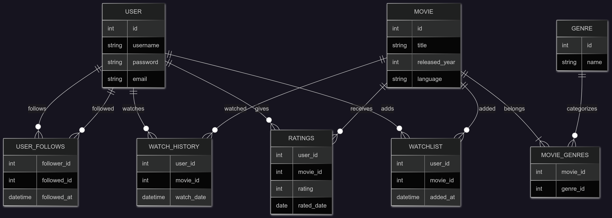

# Design Document

By Aashish Bogati

Video overview: <URL HERE>

## Scope

The database is designed to support a social movie recommendation and review platform. As such, included in the database's scope are:

* Users, including their usernames, emails, and passwords
* Follows between users, capturing who follows whom and when
* Movies, including titles, release years, and runtimes
* Genres, linked to movies to categorize them
* Ratings, including the score given by a user to a movie and when it was rated
* Watch history, tracking movies a user has watched
* Watchlist, storing movies a user plans to watch
* Recommendation functions, based on genre preferences and followed user's ratings

Out of scope are elements like cast and crew details, streaming availability, user reviews or comments.

## Functional Requirements

This database will support:

* CRUD operations for users and movies
* Users rating movies, with automatic logging of watch history
* Users following and unfollowing other users
* Managing watchlists and watch history for each user
* Recommending movies based on a user’s highest-rated genre
* Recommending movies highly rated by users they follow

Note that in this iteration, the system will not support user comments, reviews, or multimedia content like trailers or posters.

## Representation
Entities are captured in PostgreSQL tables with the following schema.

### Entities
The database include following entities:

#### Users
The `user` table includes:

* `id`, which specifies the unique ID for each user as an `INTEGER`. This column has the PRIMARY KEY constraint applied.
* `username`, which is the user’s chosen username as `TEXT`. A `UNIQUE` constraint ensures no two users can share the same username.
* `email`, which stores the user’s email address as `TEXT`, also with a `UNIQUE` constraint to avoid duplicates.
* `password`, which stores the user's password as `TEXT`.

All values are required, so the NOT NULL constraint is applied to each column.

#### User_follows
The `user_follows` table includes:

* `follower_id`, which is the ID of the user who is following another user. It is an INTEGER with a FOREIGN KEY constraint referencing the id column in the `user` table. It includes ON DELETE CASCADE to remove follows if a user is deleted.

* `followed_id`, which is the ID of the user being followed. Like follower_id, it references the `user` table and cascades deletions.

* `followed_at`, which is the `TIMESTAMP` when the follow occurred. It uses a default value of CURRENT_TIMESTAMP.

Together, `follower_id` and `followed_id` form a composite PRIMARY KEY, ensuring that each follow relationship is unique.

#### Movies
The movie table includes:

* `id`, the unique ID for each movie as an `INTEGER`, with the PRIMARY KEY constraint applied.

* `title`, the name of the movie as `TEXT`.

* `release_year`, the year the movie was released as an `INTEGER`.

* `runtime`, the movie's runtime in minutes as an `INTEGER`.

All columns except `runtime` are required. An index on `title` improves search performance.

#### Ratings
The `ratings` table includes:

* `user_id`, the ID of the user who gave the rating. It is an `INTEGER` referencing the `user` table, with ON DELETE CASCADE.

* `movie_id`, the ID of the rated movie as an `INTEGER`, referencing the `movie` table.

* `rating`, a numeric value between 0.0 and 5.0 (inclusive) stored using `NUMERIC(2,1)`, with a CHECK constraint to ensure it does not exceed 5.

* `rated_date`, a `TIMESTAMP` indicating when the rating was made, with a default of CURRENT_TIMESTAMP.

Together, `user_id` and `movie_id` form the `PRIMARY KEY`, ensuring each user can rate a movie only once.

#### Genres
The `genre` table includes:

* `id`, the unique ID for each genre as an `INTEGER`, with the `PRIMARY KEY` constraint.

* `name`, the name of the genre (e.g., Action, Comedy) as TEXT, with a `UNIQUE` constraint to avoid duplicates.

#### Movie_genres
The `movie_genre` table includes:

* `movie_id`, which references a movie in the `movie` table.

* `genre_id`, which references a genre in the `genre` table.

This table allows each movie to belong to multiple genres. A composite `PRIMARY KEY (movie_id, genre_id)` ensures uniqueness and establishes a many-to-many relationship.

#### Watch_history
The `watch_history` table includes:

* `user_id`, the ID of the user who watched the movie, referencing the `user` table with ON DELETE CASCADE.

* `movie_id`, the ID of the movie watched, referencing the `movie` table.

* `watched_at`, the time the movie was watched, with a default of CURRENT_TIMESTAMP.

The PRIMARY KEY is a combination of `user_id` and `movie_id`, ensuring one watch history entry per movie per user.

#### Watchlist
The `watchlist` table includes:

* `user_id`, the user who added the movie to their list, with a `FOREIGN KEY` referencing the `user` table.

* `movie_id`, the movie being added to the list, referencing the `movie` table.

* `added_at`, the timestamp when the movie was added, with a default of CURRENT_TIMESTAMP.

Like watch_history, the `PRIMARY KEY` is a composite of `user_id` and `movie_id`

### Relationships

The below entity relationship diagram describes the relationships among the entities in the database.

As detailed by the diagram:

* A user can rate 0 to many movies. A movie can be rated by 0 to many users. This many-to-many relationship is captured by the ratings table, which includes additional data like the rating value and timestamp.

* A user can follow 0 to many other users, and be followed by 0 to many users. This self-referencing many-to-many relationship is modeled by the user_follows table, where each follow record includes the follower, the followed user, and the timestamp of the action.

* A user can add 0 to many movies to their watchlist, and each movie can appear in 0 to many users' watchlists. This many-to-many relationship is stored in the watchlist table with an associated timestamp.

* A user can have 0 to many entries in watch_history, representing the movies they have watched. Each movie can also appear in the watch history of 0 to many users. This many-to-many relationship is captured in the watch_history table along with the watch timestamp.

* A movie can belong to 0 to many genres, and a genre can include 0 to many movies. This many-to-many relationship is modeled by the movie_genre table.

* A user is the source of 0 to many ratings, but each rating is created by one and only one user. Likewise, a movie can have many ratings, but each rating is linked to one specific movie.

* A movie is linked to 0 to many users’ watchlists, ratings, and watch history, but these relationships are all independent and stored in their respective tables (watchlist, ratings, watch_history).

* A genre can exist without being linked to a movie initially, but is typically connected through the movie_genre relationship.

## Optimizations

Per the typical queries in `queries.sql`, it is common for users of the database to search for movies by title. For that reason, an index is created on the `title` column in the `movie` table to speed up searches and lookups by movie name.

Similarly, it is expected that many queries will retrieve a user's rating history, watchlist, or watch history. Since these tables rely heavily on the `user_id` and `movie_id` columns, the use of composite primary keys on (`user_id`, `movie_id`) in the `ratings`, `watchlist`, and `watch_history` tables allows for efficient indexing and quick access by user and movie relationships.

Additionally, the `username` and `email` fields in the user table are constrained to be `UNIQUE`, which also results in internal indexing that speeds up user lookups during login, rating submissions, and follow actions.

## Limitations

The current schema only supports numeric ratings and does not include support for written reviews, comments, or multimedia feedback. Incorporating these would require additional tables and relationships.

The schema also lacks support for detailed movie metadata such as cast, crew, trailers, posters.